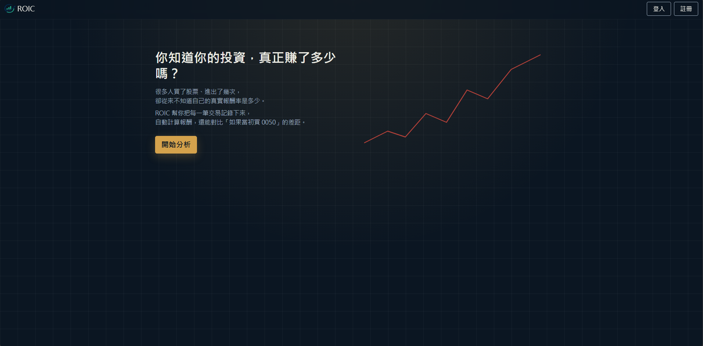
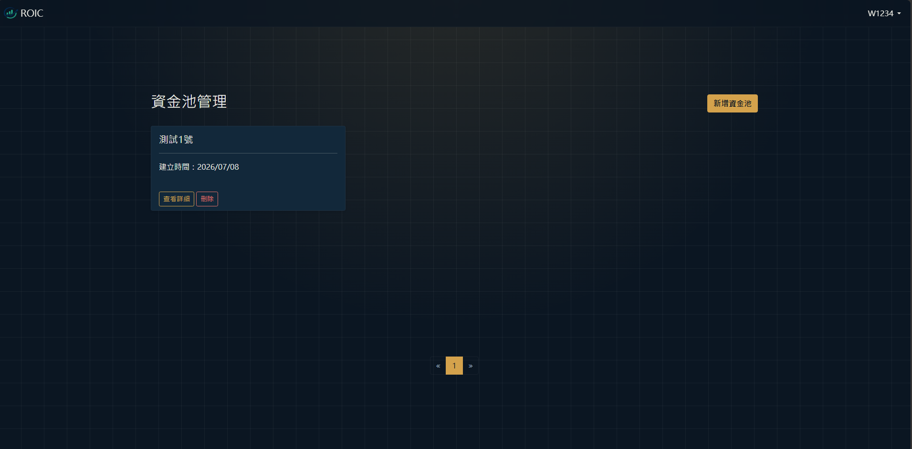
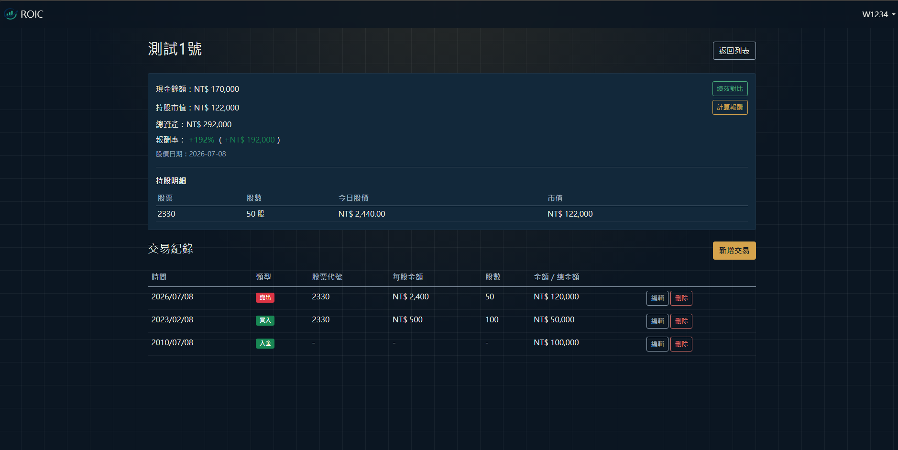
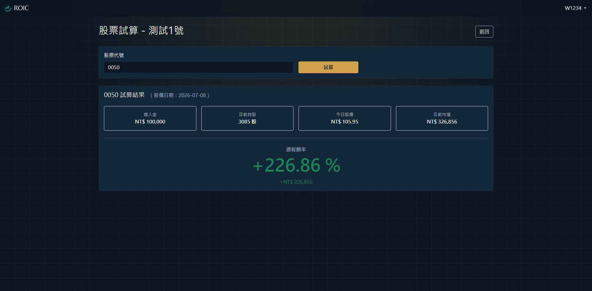

# ROIC — Return on Invested Capital

> 追蹤你的每一筆投資，清楚看見真實報酬。

**[🌐 立即使用](https://transactionhistory-production.up.railway.app)**

---

## 網頁內容

### 首頁
<!-- 放首頁截圖 -->

### 資金池管理
<!-- 放資金池管理截圖 -->
- **資金池管理**：建立多個投資帳戶，分別追蹤不同策略

### 資金池詳情
- **交易紀錄**：完整紀錄入金、出金、買入、賣出
- **計算報酬**：即時串接股價，自動計算現金餘額、持股市值與報酬率
<!-- 放詳情頁截圖 -->


### 績效對比
<!-- 放績效對比截圖 -->
- **績效對比**：假設當初把資金投入指定股票（如 0050、AAPL），報酬會是多少


---
## 技術架構

| 項目 | 技術 |
|------|------|
| 前端 | ASP.NET Core MVC、Bootstrap 5 |
| 後端 | ASP.NET Core 8、Entity Framework Core |
| 資料庫 | MySQL（Aiven） |
| 股價 API | Python FastAPI、yfinance |
| 部署 | Railway | Aiven |

---

## 本地開發

### 前置需求

- .NET 8 SDK
- MySQL
- Python 3.x

### 安裝步驟

1. Clone 專案

```bash
git clone https://github.com/AfreecaKing/Transaction_History.git
cd Transaction_History
```

2. 設定資料庫連線字串

在 `WebApplication1/appsettings.json`：

```json
{
  "ConnectionStrings": {
    "DefaultConnection": "Server=localhost;Port=3306;Database=MyDb;User=root;Password=yourpassword;"
  },
  "StockApi": {
    "BaseUrl": "http://localhost:8000"
  }
}
```

3. 執行 Migration

```powershell
Update-Database
```

4. 啟動 Python 股價 API

```bash
cd StockApi
pip install -r requirements.txt
uvicorn main:app --reload --port 8000
```

5. 啟動 ASP.NET 專案

```bash
cd WebApplication1
dotnet run
```

---

## 專案結構

```
Transaction_History/
├── WebApplication1/        # ASP.NET Core MVC 主專案
│   ├── Controllers/
|   |   ├──AccountController # Login、Register、Logout       
│   ├── Models/             # User、FundPool、FundTransaction、ViewModel
│   ├── Views/              # Razor 頁面
|   |   ├──Account            # 登入與註冊頁面
│   ├── Services/           # StockService（呼叫 Python API）
│   └── Migrations/         # EF Core Migration
└── StockApi/               # Python FastAPI 股價服務
    ├── main.py             # API 路由
    └── requirements.txt
```

---

